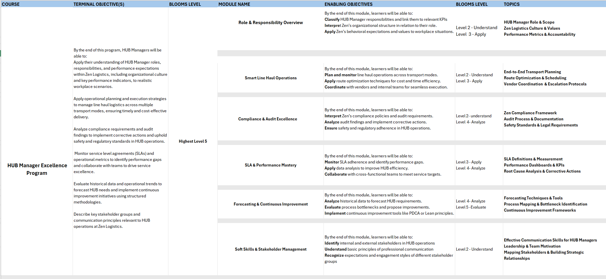
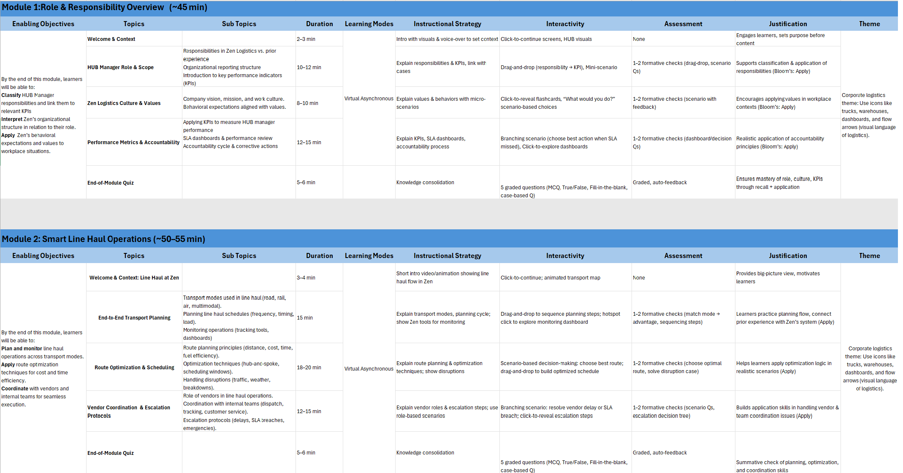
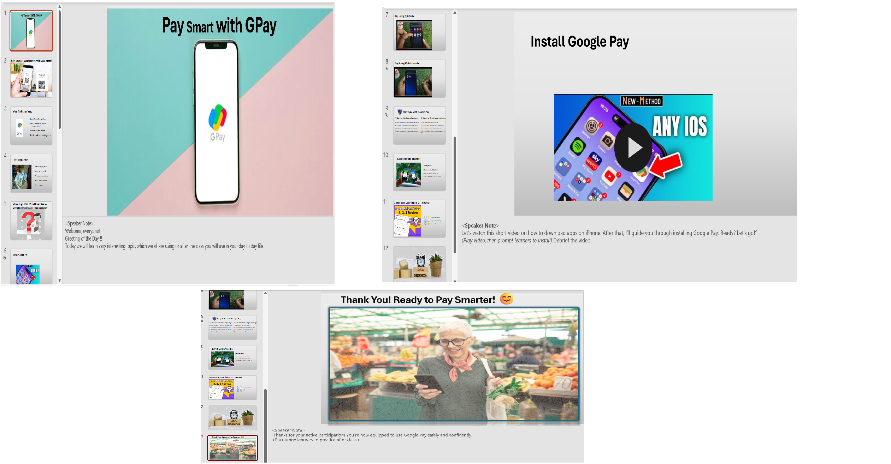

# 🎓 In-Class Assignment Activities

During my Instructional Design sessions, I worked on several in-class assignments that applied real-world learning design principles.  
These include **Curriculum Design (CD)** for a Logistics Company and **Storyboarding (ILT)** for a digital payment training module.

---

## 📦 Curriculum Design – Logistics Company

This assignment focused on creating a **curriculum framework and detailed design document** for *Zen Freight Solutions*.  
The objective was to train **Hub Managers** to understand their **roles, KPIs, and company culture**.

### Key Highlights
- Structured design based on **Bloom’s Taxonomy** and **ADDIE**  
- Modular approach for **ILT** and **VILT** sessions  
- Includes scenario-based activities, microlearning elements, and formative checks  

📄 **[View Full Curriculum Design & DDD](https://docs.google.com/spreadsheets/d/1EpdyLZr8mvphU3PqQIKPt3U5nnlEDBrQ/edit?usp=sharing&ouid=111454670665077416343&rtpof=true&sd=true)**  

---

## 🧠 Storyboarding – Google Pay (ILT)

### Project Overview
This project is an Instructor-Led Training (ILT) storyboard designed to teach first-time users how to make safe and simple payments using Google Pay.  
The storyboard follows **Gagné’s 9 Events of Instruction** to ensure structure and engagement.

### Learning Objectives
- Install Google Pay on an iPhone  
- Make payments using QR code and mobile number  
- Apply safety measures while using Google Pay  
- Practice sending and receiving money through an activity  

### Target Audience
Beginner users, including elderly learners new to mobile payments.

### Design Approach
- Framework: **Gagné’s 9 Events of Instruction**  
- Mode: **ILT** with interactive discussions, video demos, and reflections  
- Tools: MS PowerPoint  

### Key Highlights
- **Interactive Opening:** Question-led discussion  
- **Demo Video:** Installation steps on iPhone  
- **Practice Activity:** ₹1 transfer role-play  
- **Safety Focus:** Do’s ✔️ and Don’ts ❌ slides  
- **Reflection Tool:** 3–2–1 review  

📂 **[View Storyboard File](https://docs.google.com/presentation/d/1Rnmt4FwYMLMe7dFqQMzqPKsO60bDnXnk/edit?usp=drive_link&ouid=111454670665077416343&rtpof=true&sd=true)**  

---

💡 *These in-class assignments demonstrate the practical application of instructional design frameworks in both corporate and skill-based learning contexts.*

 
