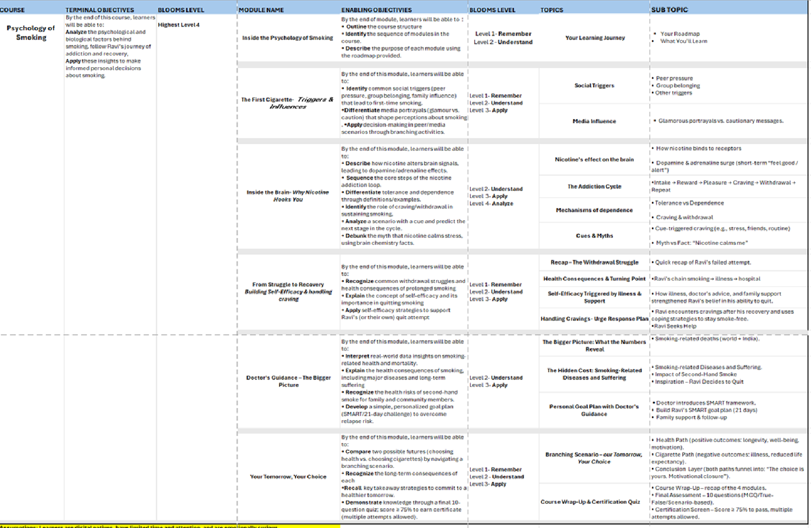
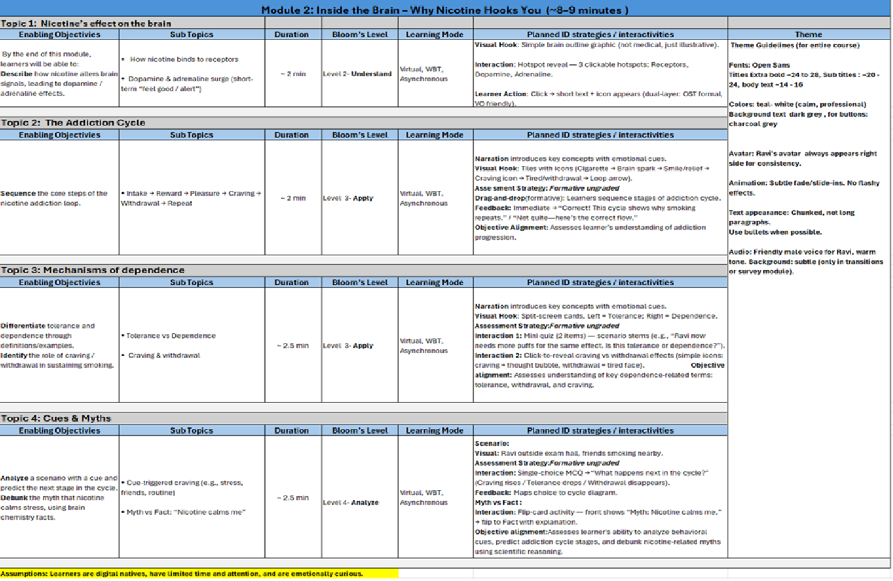
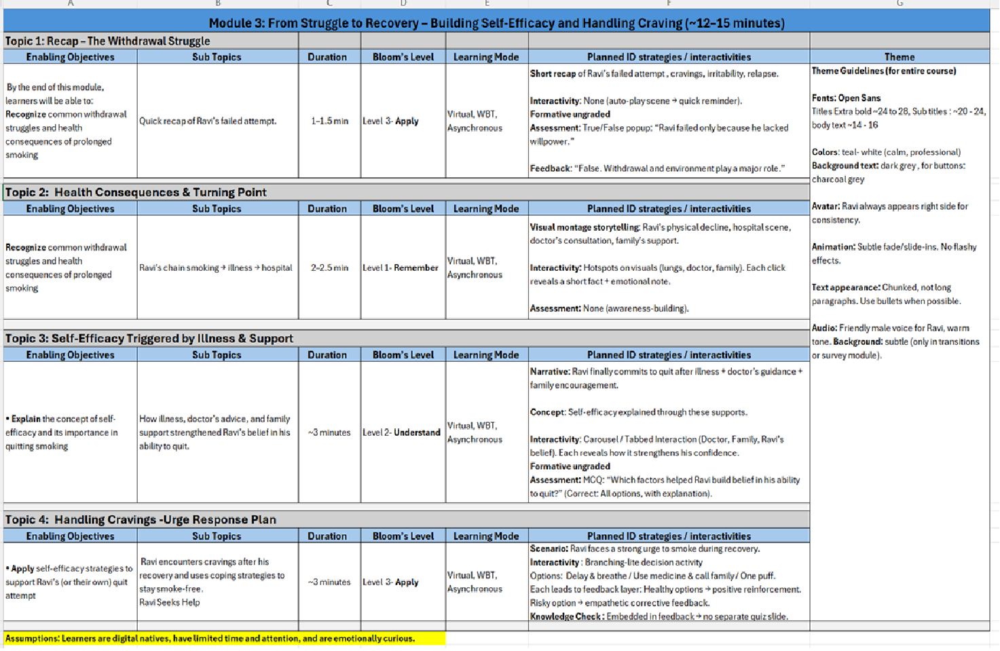
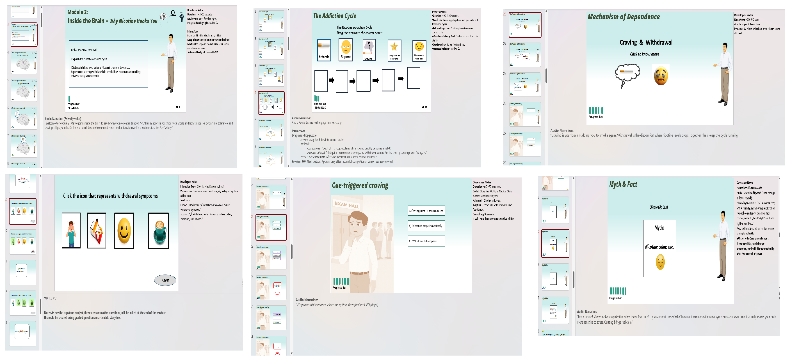

  <h1 style="color:#1e3a8a; text-align:center;">🎓 Capstone Project: Psychology of Smoking</h1>
<h2 style="color:#2563eb;">Project Overview</h2>
 

 <b >Psychology of Smoking</b> is a 60-minute web-based training (WBT) designed to raise awareness about the addictive nature of smoking, its neurological effects, and strategies for quitting. This course reflects my ability to translate instructional design principles into engaging digital learning experiences.

  

  <h2 style="color:#2563eb;">📌 Design Approach</h2>
  
The course design follows the <strong>ARCS Model</strong> to capture learner attention, build relevance, instill confidence, and ensure satisfaction. Content is scaffolded to support learning progression, combining multimedia, interactivity, and reflection activities.

  <h2 style="color:#2563eb;">📚 Module Highlights</h2>
  <ul>
    <li><strong>Module 1:</strong> The First Cigarette – Triggers & Influences</li>
    <li><strong>Module 2:</strong> Inside the Brain – Why Nicotine Hooks You</li>
    <li><strong>Module 3:</strong> From Struggle to Recovery – Building Resilience</li>
    <li><strong>Module 4:</strong> Doctor’s Guidance – The Bigger Picture</li>
    <li><strong>Module 5:</strong> Your Tomorrow, Your Choice – Building a Smoke-Free Future</li>
  </ul>

  <h2 style="color:#2563eb;">📝 Assessment Design</h2>
  
Formative assessments are embedded throughout modules using quizzes, reflections, and interactions. A <strong>summative quiz</strong> evaluates learners at the end, featuring MCQs, true/false, hotspots, and scenario-based items aligned with Bloom’s taxonomy.

  <h2 style="color:#2563eb;">⚡ Challenges & Mitigation</h2>
  <ul>
    <li><strong>Challenge:</strong> Limited access to free trial tools (restricted downloads and features).  
    <strong>Mitigation:</strong> Showcased outputs via screenshots, external links, and version control.</li>
    <li><strong>Challenge:</strong> Iterative learning curve during project build.  
    <strong>Mitigation:</strong> Maintained agile approach with continuous revisions and updates.</li>
  </ul>

  <h2 style="color:#2563eb;">🛠️ Tools & Deliverables</h2>
  <ul>
    <li>PowerPoint (Storyboard)</li>
    <li>Excel (CDD & DDD)</li>
    <li>Authoring Tools (for WBT prototype)</li>
  </ul>

  <h2 style="color:#2563eb;">📂 Project Structure</h2>
  <ul>
    <li><code>CDD.xlsx</code> – Content Design Document</li>
    <li><code>DDD.xlsx</code> – Detailed Design Document</li>
    <li><code>Storyboard.pptx</code> – Visual storyboard</li>
    <li><code>WBT/</code> – Prototype course output</li>
    <li><code>README.md</code> – Project description (this page)</li>
  </ul>

  <h2 style="color:#2563eb;">📷 Preview</h2>   
  
<!-- CDD Preview -->
<h3>📄 Content Design Document (CDD)</h3>  

The Content Design Document (CDD) outlines the high-level course structure, mapping learning objectives to content, strategies, and assessments.  
<a href="https://docs.google.com/spreadsheets/d/1dsU4jU8vVKDIChksb0u_x7nyrgls5ENw/edit?usp=drive_link&ouid=111454670665077416343&rtpof=true&sd=true" target="_blank" style="color:#1d4ed8;">Explore full CDD here →</a>

<!-- DDD Preview -->
<h3>📊 Detailed Design Document (DDD)</h3>
<h4> Module 2</h4>
  
 
<h4>Module 3</h4>

The Detailed Design Document (DDD) expands the CDD into screen-level detail, specifying narration, visuals, and interactivity for each module. Shown here are excerpts from Module 2 and Module 3.  
<a href="https://docs.google.com/spreadsheets/d/1dsU4jU8vVKDIChksb0u_x7nyrgls5ENw/edit?usp=drive_link&ouid=111454670665077416343&rtpof=true&sd=true" target="_blank" style="color:#1d4ed8;">Explore full DDD here →</a>

<!-- Storyboard Preview -->
<h3>🎨 Storyboard (SB)</h3>

The Storyboard demonstrates how content flows visually within the course. It integrates on-screen text, graphics, and interactive elements to bring the instructional design to life. This example shows a storyboard slide for Module 2.  
<a href="https://docs.google.com/presentation/d/1mjg8K0Rvm77fjN6pJ7VZ6g7WrBP2veh_/edit?usp=drive_link&ouid=111454670665077416343&rtpof=true&sd=true" target="_blank" style="color:#1d4ed8;">Explore full Storyboard here →</a>
 

<h2 style="color:#2563eb;">🎬 First Scene Overview – Psychology of Smoking Capstone Project</h2>
<!-- Video Thumbnail Linking to YouTube -->

  

<em>Click the image above to watch the video</em>

<!-- Description -->

The opening scene of my capstone project presents the roadmap of the program. A narrator introduces the learning journey step by step, with each module name appearing alongside supportive visuals to give learners a clear picture of the flow.

This scene was created using a combination of tools and processes:

<ul>
  <li><strong>Synthesia</strong> – for generating the narrator.</li>
  <li><strong>OBS Studio</strong> – for capturing and refining the scene.</li>
  <li><strong>Articulate Storyline 360</strong> – for assembling interactive elements.</li>
  <li><strong>Microsoft PowerPoint</strong> – for initial storyboarding.</li>
  <li><strong>MS Excel</strong> – for curriculum design and the detailed design map.</li>
</ul>

Together, these elements establish the foundation of the program by showing learners what to expect and how the modules connect as part of the overall learning journey.

<h2> Module 1: The First Cigarette – Triggers and Influences  </h2>

An interactive eLearning module built in <strong>Storyline 360 </strong> that explores the psychology behind smoking initiation. Featuring storytelling with voice-over, click-to-reveal exploration, and drag-and-drop formative assessment, this course delivers **Level 2 interactivity** to engage learners and reinforce key concepts.  

👉 <a href=https://github.com/DipsSingh/Explore-Portfolio/tree/main/Portfolio/Capstone-Project/Psychology%20of%20Smoking_Module%201/index.html> View Module 1 </a>

  <h2 style="color:#2563eb;">🎯 Learning Outcomes</h2>
  
By the end of this course, learners will be able to:

  <ul>
    <li>Recognize triggers and psychological factors influencing smoking habits</li>
    <li>Understand the neurological effects of nicotine</li>
    <li>Explore strategies and resources for quitting</li>
    <li>Develop confidence in planning a smoke-free future</li>
  </ul>

  <h2 style="color:#2563eb;">🚀 Impact / Reflection</h2>
  
This project demonstrates my ability to design a structured, engaging, and impactful digital learning solution. It showcases end-to-end instructional design skills, from curriculum planning to final prototype delivery.

  <h2 style="color:#2563eb;">🔗 Access Project</h2>
  

    - 📄 <a href="https://docs.google.com/spreadsheets/d/1dsU4jU8vVKDIChksb0u_x7nyrgls5ENw/edit?usp=drive_link&ouid=111454670665077416343&rtpof=true&sd=true" target="_blank" style="color:#1d4ed8;">View Excel (CDD & DDD)</a> 
    - 🎞️ <a href="https://docs.google.com/presentation/d/1mjg8K0Rvm77fjN6pJ7VZ6g7WrBP2veh_/edit?usp=drive_link&ouid=111454670665077416343&rtpof=true&sd=true" target="_blank" style="color:#1d4ed8;">View Storyboard</a> 
    - 🌐 <a href="YOUR_WBT_LINK" target="_blank" style="color:#1d4ed8;">Launch Prototype</a>
  

