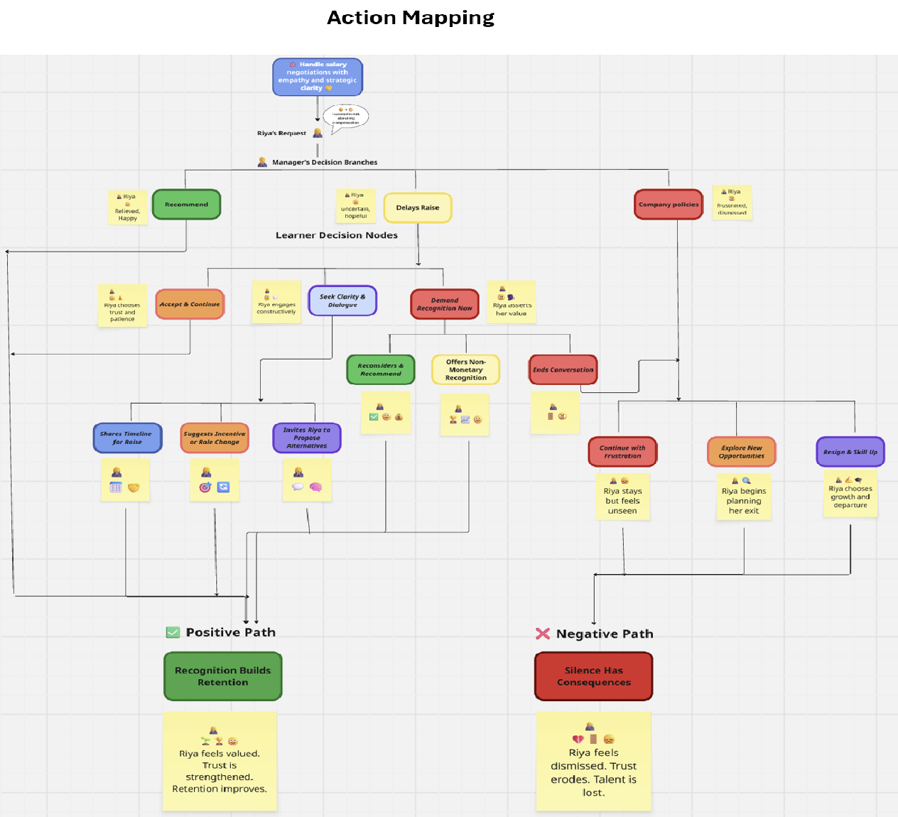
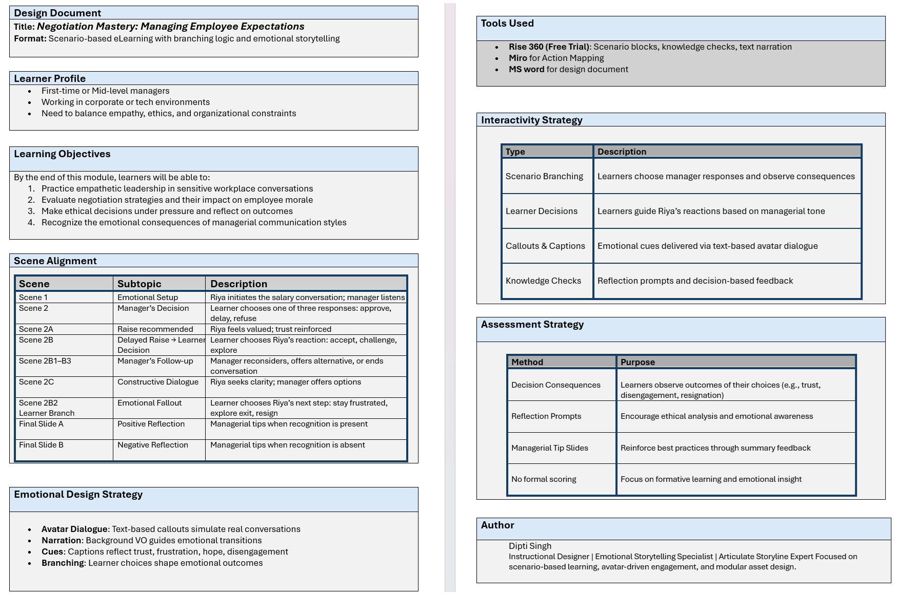
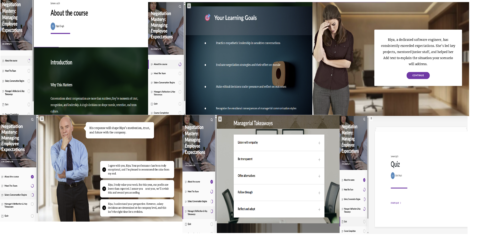

<h1 style="color:#1e3a8a; text-align:center;">Negotiation Mastery: Managing Employee Expectations</h1>
<h2 style="color:#1e3a8a; text-align:center;">Scenario-Based eLearning | Rise 360 | Emotional Storytelling</h2>

This interactive module simulates a high-stakes salary negotiation between an employee and her manager. Built in Rise 360, it guides learners through emotionally nuanced decision-making, ethical leadership, and strategic communication.

<h2 style="color:#1e3a8a;">Learning Objectives</h2>
<ul>
  <li>Practice empathetic leadership in sensitive workplace conversations
  <li>Evaluate negotiation strategies and their impact on employee morale
  <li>Make ethical decisions under pressure and reflect on outcomes
  <li>Recognize the emotional consequences of managerial communication styles
</ul>

<h2 style="color:#1e3a8a;">Key Features</h2>
<ul>
  <li><b>Three manager response paths:</b> agreement, negotiation, refusal
  <li><b>Learner-driven branching:</b> follow-up decisions based on Riya’s reactions
  <li><b>Narration via voiceover</b> during scene transitions
  <li><b>Text-based avatar dialogue</b> for emotional clarity and accessibility
  <li><b>Modular design</b> for future expansion with Storyline integration
</ul>

<h2 style="color:#1e3a8a;">Module Structure</h2>

<table style="width:100%; border-collapse:collapse;">
  <tr style="background-color:#e2e8f0;">
    <th style="padding:8px; border:1px solid #cbd5e1;">Scene</th>
    <th style="padding:8px; border:1px solid #cbd5e1;">Description</th>
  </tr>
  <tr>
    <td style="padding:8px; border:1px solid #cbd5e1;"><b>Scene 1</b></td>
    <td style="padding:8px; border:1px solid #cbd5e1;">Introduction and emotional setup</td>
  </tr>
  <tr>
    <td style="padding:8px; border:1px solid #cbd5e1;"><b>Scene 2</b></td>
    <td style="padding:8px; border:1px solid #cbd5e1;">Manager’s decision with branching outcomes</td>
  </tr>
  <tr>
    <td style="padding:8px; border:1px solid #cbd5e1;"><b>Scene 3</b></td>
    <td style="padding:8px; border:1px solid #cbd5e1;">Learner reflection and ethical analysis</td>
  </tr>
</table>

<h2 style="color:#1e3a8a;">Tools Used</h2>
<ul>
  <li>MS Word – Design Document</li>
  <li>Miro – Action Mapping</li>
  <li>Rise 360 (free trial) – Development</li>
</ul>

<h2 style="color:#1e3a8a;">Preview</h2>

Explore the design thinking and prototyping behind the course:

<h3 style="color:#2563eb;">Action Mapping</h3>
 

 - [Action Mapping (Miro Board)](https://miro.com/app/board/uXjVJ-hQMEo=/?share_link_id=891743474000)   
 
<h3 style="color:#2563eb;">Design Document</h3>
 

<a href="https://docs.google.com/document/d/1h9H6EjGWLn1glgN1wUVprSdiO66Ego50/edit?usp=drive_link&ouid=111454670665077416343&rtpof=true&sd=true" target="_blank">View Design Document</a>

<h3 style="color:#2563eb;">Prototyping</h3>
 
<a href="https://rise.articulate.com/authoring/iA5OJzZRp0heIiF0DUcowSw-xWezFrgN/preview" target="_blank">Course Prototype (Rise 360 Screenshot)</a>

<h2 style="color:#1e3a8a;">👩‍🎓 Author</h2>

<b>Dipti Singh</b> 
Instructional Designer | Emotional Storytelling Specialist 
Expert in scenario-based learning, avatar-driven engagement, and modular asset design.

